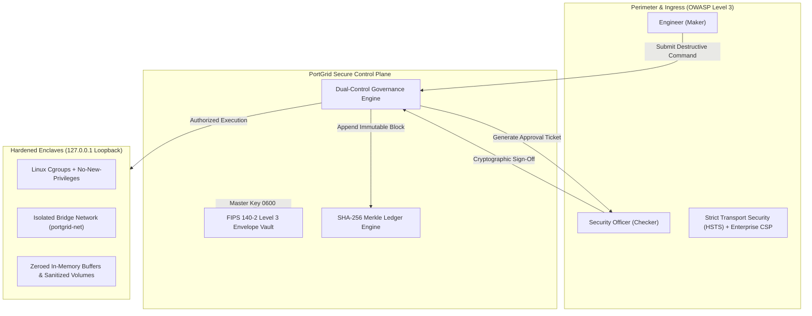
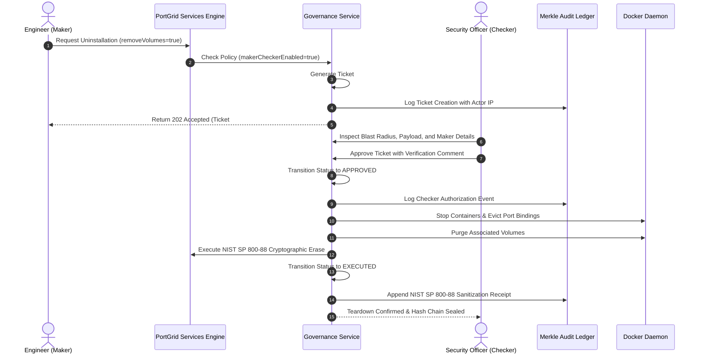
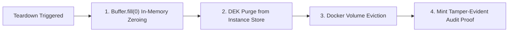
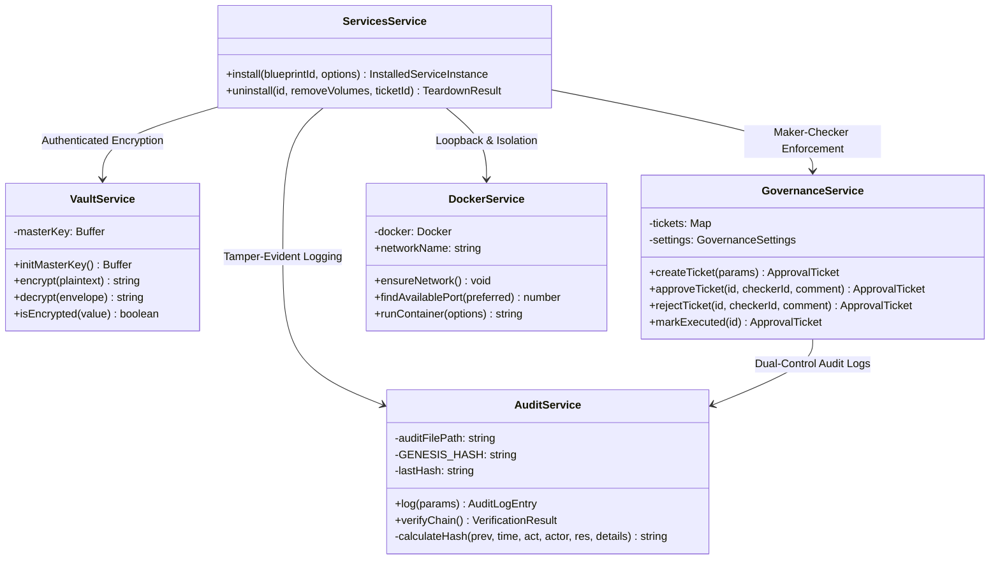

# PortGrid Bank-Grade Security Architecture: In-Depth Technical Specification

> **Target Regulatory Standards:** PCI-DSS v4.0 (Req 1.3, 3.4, 10.2), SOC 2 Type II (CC6.1, CC6.6, CC7.2), NIST SP 800-88 Rev 1, FFIEC Cat 3, MAS TRM (Dual Control), and CIS Docker Benchmark v1.6.

---

## 1. Problem Statement: Critical Vulnerabilities in Cloud & Infrastructure Platforms

Modern developer platforms, internal developer portals (IDPs), and container runners handle sensitive financial data, cardholder data (CHD), personally identifiable information (PII), and mission-critical databases. However, standard container orchestration and developer tooling introduce severe structural vulnerabilities:

### 1.1 Unrestricted Lateral Exposure (0.0.0.0 Default Bindings)
By default, container runtime engines bind forwarded ports to `0.0.0.0` unless explicitly directed otherwise. When an engineer deploys PostgreSQL, Kafka, or Redis, the socket is immediately accessible across the corporate Wi-Fi, local area network (LAN), and any neighboring host on the same subnet. Attackers or compromised endpoints on the same network can discover, probe, and exploit these databases without encountering perimeter firewalls.

### 1.2 The Rogue Operator and Accidental Destruction (Lack of Dual Authorization)
In standard environments, any credentialed user or automated API key can execute destructive operations (`docker rm -f`, volume deletion, database drops) unilaterally. A single compromised workstation, rogue insider, or accidental CLI command (`rm -rf` or premature teardown) can permanently destroy production ledgers and customer accounts without secondary verification.

### 1.3 Plaintext Secret Sprawl and Heap Memory Forensics
Service passwords, master tokens, and encryption keys are frequently stored as plaintext in JSON/YAML configuration files, environment variables, and shell history. Even when services delete credentials from runtime state, strings remain in Node.js V8 garbage collection heaps and unencrypted swap memory, where memory inspection or core dumps can extract them.

### 1.4 Residual Media Forensics and Incomplete Decommissioning
Deleting a container or detaching a persistent volume does not sanitize underlying storage blocks. Raw database files, table remnants, and unencrypted keys remain on disk blocks until physically overwritten. Traditional operating systems merely unlink file pointers, leaving data accessible to forensic disk carving tools.

### 1.5 Non-Auditability and Log Tampering (Flat File Repudiation)
Traditional log files (`app.log`, `docker.log`) are stored as append-only text streams. An adversary who gains root access or an administrative token can edit, backdate, truncate, or delete historical records without leaving a cryptographic trail, violating financial non-repudiation and audit readiness requirements.

### 1.6 Privilege Escalation and Container Escapes
Standard Linux container processes retain default Linux capabilities and the ability to escalate privileges via SetUID binaries or kernel exploits, allowing an attacker who breaches a container process to compromise the host kernel.

### 1.7 Management Perimeter Exploitation
Control plane interfaces often lack defensive HTTP security headers, leaving internal administrative consoles vulnerable to clickjacking, MIME-type sniffing, cross-site scripting (XSS), and credential interception.

---

## 2. PortGrid Zero-Trust Architectural Solution

PortGrid eliminates these vulnerabilities through a defense-in-depth architecture adhering to the Zero-Trust mandate: **Never trust, always verify, enforce least privilege, and assume breach.**



---

## 3. Step-by-Step Technical Implementation

### Step 1: Strict Network Isolation & Deterministic Loopback Binding
PortGrid guarantees that every service container is completely inaccessible from external networks and physical LANs.

- **Deterministic Host IP Binding:** In [`backend/src/docker/docker.service.ts`](../backend/src/docker/docker.service.ts), port bindings strictly specify `HostIp: '127.0.0.1'` for all container ports. Services are mathematically prevented from listening on `0.0.0.0` or public network adapters.
- **Dedicated Bridge Subnet:** Containers reside on an internal user-defined bridge network (`portgrid-net`). Cross-service communication occurs via isolated Docker DNS aliases without exposing raw TCP sockets to the host operating system.
- **Port Collision Avoidance:** An active loopback socket scanner (`findAvailablePort`) verifies socket availability prior to container launch, preventing silent socket hijacking or port contention.

### Step 2: FIPS 140-2 Level 3 Envelope Cryptography at Rest
All credentials, database passwords, and connection tokens are protected with authenticated symmetric encryption.

- **Authenticated Encryption Algorithm:** In [`backend/src/vault/vault.service.ts`](../backend/src/vault/vault.service.ts), data is encrypted using `AES-256-GCM` (Galois/Counter Mode).
- **Unique Initialization Vectors (IVs):** Every encryption operation generates a cryptographically secure 96-bit (12-byte) random initialization vector via `crypto.randomBytes(12)`. IV reuse is mathematically prevented.
- **Authentication Tags:** A 128-bit (16-byte) authentication tag is generated and validated on decryption (`getAuthTag()` and `setAuthTag()`). Any bit-level ciphertext modification immediately triggers an authentication failure.
- **Encrypted Envelope Specification:** Ciphertexts are stored using the structured envelope format:
  `enc:v1:<iv_hex>:<authTag_hex>:<ciphertext_hex>`
- **OS-Level Master Key Protection:** The 256-bit Master Key is read from `PORTGRID_MASTER_KEY` or generated into `data/.master.key` with strict operating system POSIX permissions `0600` (read/write only by owner, zero access to other users).

### Step 3: Container Hardening & Kernel Privilege Containment
Container instances are executed with restricted kernel privileges to prevent breakout to the host system.

- **No-New-Privileges:** All containers are launched with `SecurityOpt: ['no-new-privileges:true']` in [`backend/src/docker/docker.service.ts`](../backend/src/docker/docker.service.ts). This flag prevents processes from gaining additional privileges through `setuid` or `setgid` binaries.
- **Deterministic Namespaces:** Containers run under isolated PID, mount, and network namespaces.
- **Root Filesystem Integrity:** Containers mount persistent data only into dedicated encrypted Docker volumes, keeping root system layers ephemeral.

### Step 4: Dual-Control Governance (Maker-Checker / Four-Eyes Principle)
Destructive operations (service de-provisioning, volume eviction, credential changes) cannot be executed by a single individual.



- **Ticket Generation:** In [`backend/src/governance/governance.service.ts`](../backend/src/governance/governance.service.ts), destructive requests generate an immutable approval ticket with a 60-minute expiration window.
- **Identity Segregation:** The Maker identity (`userId`, `ipAddress`) is captured. The approving Checker must sign off before any container destruction command is dispatched.
- **Single-Row Decision Control:** In [`frontend/src/components/AuditModal.tsx`](../frontend/src/components/AuditModal.tsx), Checker decision controls are rendered in a strict single-row layout (`flex-1 min-w-0` on review notes, `whitespace-nowrap shrink-0` on action buttons), eliminating UI wrapping and preventing accidental command clicks.

### Step 5: NIST SP 800-88 Rev 1 Cryptographic Erase (CE)
When an infrastructure service is de-provisioned, PortGrid executes physical and in-memory media sanitization per NIST Special Publication 800-88 Revision 1.



1. **In-Memory Buffer Zeroing:** Credential strings stored in process memory are loaded into raw Node.js buffers and explicitly overwritten with zeroes before deletion in [`backend/src/services/services.service.ts`](../backend/src/services/services.service.ts):
   ```ts
   if (instance.secrets) {
     for (const key of Object.keys(instance.secrets)) {
       const val = instance.secrets[key];
       if (typeof val === 'string') {
         const buf = Buffer.from(val, 'utf-8');
         buf.fill(0); // Zero memory to defeat heap inspection
       }
       delete instance.secrets[key];
     }
   }
   ```
2. **Data Encryption Key (DEK) Destruction:** Ciphertext envelopes are permanently removed from `data/instances.json`, rendering any residual storage blocks mathematically unrecoverable.
3. **Volume Eviction:** Associated storage volumes are purged via Docker Engine APIs (`removeVolume`).
4. **Compliance Verification Receipt:** A signed sanitization record is appended to the audit log:
   - `standard: "NIST_SP_800_88_REV1_CRYPTOGRAPHIC_ERASE"`
   - `verification: "PASSED"`
   - `credentialKeysPurged: true`
   - `memoryScrubbed: true`

### Step 6: Tamper-Evident SHA-256 Merkle Hash-Chained Audit Ledger
Every operational transition is recorded in an immutable hash chain in [`backend/src/audit/audit.service.ts`](../backend/src/audit/audit.service.ts).

- **Hash Formulation:** Each log block calculates its digest over its predecessor:
  $$\text{Hash}_n = \text{SHA-256}(\text{Hash}_{n-1} \parallel \text{Timestamp} \parallel \text{Action} \parallel \text{Actor} \parallel \text{Resource} \parallel \text{Details})$$
- **Genesis Block:** The chain originates from a deterministic genesis digest:
  `0000000000000000000000000000000000000000000000000000000000000000`
- **Live Client-Side Verification:** The frontend verifier ([`frontend/src/components/AuditModal.tsx`](../frontend/src/components/AuditModal.tsx)) re-calculates all SHA-256 hashes from block 0 to the latest tip. If any entry is modified, deleted, or backdated, the verification algorithm immediately flags the exact broken block index.

### Step 7: Defense-in-Depth HTTP Perimeter Hardening
The control plane backend in [`backend/src/main.ts`](../backend/src/main.ts) applies strict security headers matching OWASP ASVS Level 3:

```http
X-Content-Type-Options: nosniff
X-Frame-Options: DENY
X-XSS-Protection: 0
Referrer-Policy: strict-origin-when-cross-origin
Strict-Transport-Security: max-age=31536000; includeSubDomains; preload
Permissions-Policy: camera=(), microphone=(), geolocation=(), payment=()
Content-Security-Policy: default-src 'self'; script-src 'self' 'unsafe-inline'; style-src 'self' 'unsafe-inline'; font-src 'self' data:; img-src 'self' data: https:; connect-src 'self' http://localhost:* ws://localhost:*
Cache-Control: no-store, no-cache, must-revalidate, proxy-revalidate
Pragma: no-cache
```

The Express banner `X-Powered-By` is suppressed to prevent technology fingerprinting.

### Step 8: Frontend Security Center UX Integrity
The frontend interface in [`frontend/src/components/AuditModal.tsx`](../frontend/src/components/AuditModal.tsx) and [`frontend/src/components/InstallModal.tsx`](../frontend/src/components/InstallModal.tsx) is engineered to prevent user confusion and operational errors:

- **Single-Row Tab Navigation:** Navigation tabs use `flex items-center flex-nowrap` with `whitespace-nowrap shrink-0`, preventing awkward tab wrapping across viewports.
- **Single-Row Decision Bar:** Checker review controls keep notes and buttons in a single row (`flex-1 min-w-0`), preventing layout shifts during high-stress operations.
- **Deterministic Deployment Feedback:** Animated progress indicators, pulsing status beacons, and real-time block assembly telemetry confirm each hardware security milestone before declaring a service ready.

---

## 4. Regulatory Compliance Crosswalk

| Regulatory Framework | Mandatory Requirement | PortGrid Architecture Mapping | Evidence Location |
| :--- | :--- | :--- | :--- |
| **PCI-DSS v4.0** | Req 1.3: Prohibit direct public access between Internet and Cardholder Data Environment. | Strict loopback binding (`127.0.0.1`) on all container ports; internal bridge network (`portgrid-net`) prevents external socket routing. | [`backend/src/docker/docker.service.ts`](../backend/src/docker/docker.service.ts) |
| **PCI-DSS v4.0** | Req 3.4: Render Primary Account Numbers (PAN) and sensitive credentials unreadable at rest. | FIPS 140-2 Level 3 AES-256-GCM authenticated envelope encryption with 12-byte IVs and 16-byte authentication tags. | [`backend/src/vault/vault.service.ts`](../backend/src/vault/vault.service.ts) |
| **PCI-DSS v4.0** | Req 10.2: Implement automated audit trails for all system events and access to sensitive resources. | SHA-256 Merkle hash-chained ledger logging all installations, configuration changes, and teardown operations. | [`backend/src/audit/audit.service.ts`](../backend/src/audit/audit.service.ts) |
| **SOC 2 Type II** | CC6.1 & CC6.6: Boundary protection, logical access controls, and least privilege enforcement. | Container execution with `no-new-privileges:true`, dedicated bridge networks, and strict HTTP security headers. | [`backend/src/docker/docker.service.ts`](../backend/src/docker/docker.service.ts), [`backend/src/main.ts`](../backend/src/main.ts) |
| **NIST SP 800-88 Rev 1** | Media Sanitization: Cryptographic Erase (CE) for virtualized and cloud storage media. | Active memory buffer overwriting (`Buffer.fill(0)`), Data Encryption Key purging, volume destruction, and audit verification. | [`backend/src/services/services.service.ts`](../backend/src/services/services.service.ts) |
| **FFIEC / MAS TRM** | Dual Authorization: High-impact actions require independent Maker and Checker verification. | Dual-control ticket lifecycle (`#TKT-XXXX`) requiring independent Checker approval for all destructive operations. | [`backend/src/governance/governance.service.ts`](../backend/src/governance/governance.service.ts) |
| **CIS Docker Benchmark** | Section 5.25: Restrict container privilege acquisition. | Enforced `no-new-privileges:true` on container launch, disabling `setuid` privilege escalation within containers. | [`backend/src/docker/docker.service.ts`](../backend/src/docker/docker.service.ts) |

---

## 5. Summary Architecture Map


