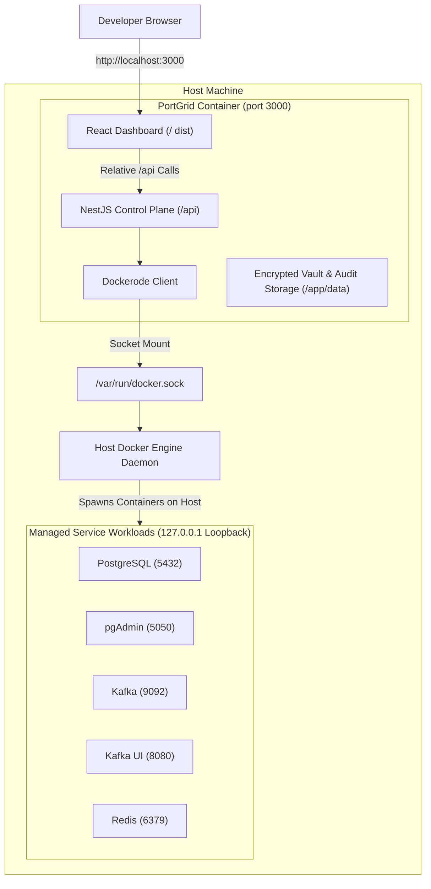

# PortGrid Shipping and Deployment Guide

## 1. Shipping Architecture Overview

PortGrid is designed to be shipped as a single, self-contained container image or run directly from source. It functions as a local developer infrastructure platform and enterprise-grade service orchestrator.

### 1.1 Unified Single-Port Architecture

PortGrid packages both the frontend web dashboard (React, Vite, Tailwind CSS) and the control plane backend (NestJS, TypeScript) into a unified runtime:
- Port 3000 serves the web dashboard static assets for all client routes (`/`).
- Port 3000 serves all control plane REST endpoints under `/api/*`.
- This eliminates the need for reverse-proxy sidecars (such as Nginx), removes Cross-Origin Resource Sharing (CORS) complexity in production, and provides a single entry point for end-users.

### 1.2 Container-in-Host Orchestration (Docker-outside-of-Docker / DooD)

PortGrid manages third-party services (such as PostgreSQL 16, Apache Kafka, Redis 7, Keycloak, Jenkins, and RabbitMQ) using the host Docker engine via socket forwarding.



Key Architectural Principles:
- Socket Forwarding: Mounting `/var/run/docker.sock` allows the PortGrid container to communicate directly with the host Docker daemon.
- Host-Level Performance: Managed database and broker containers run directly on the host Docker engine, taking advantage of native I/O and caching.
- Strict Loopback Isolation: PortGrid binds all provisioned containers strictly to host loopback (`127.0.0.1`), ensuring zero exposure to external local area networks (LAN) or public interfaces.

---

## 2. End-User Distribution and Execution Options

End users can run PortGrid using any of the four distribution channels below.

### Option A: One-Command Docker Run (Recommended)

This is the fastest method for developers. No Node.js or development tooling is required on the host system.

```bash
docker run -d \
  --name portgrid \
  --restart unless-stopped \
  -p 3000:3000 \
  -v /var/run/docker.sock:/var/run/docker.sock \
  -v portgrid_data:/app/data \
  portgrid/portgrid:latest
```

Once running, navigate to:
```
http://localhost:3000
```

### Option B: Docker Compose

For teams managing their development environments via Compose files, a clean `docker-compose.yml` is provided at the root of the repository:

```bash
docker compose up -d
```

To view container logs:
```bash
docker compose logs -f portgrid
```

To stop PortGrid:
```bash
docker compose down
```

### Option C: Running From Source (Local Development)

Developers contributing to PortGrid can execute the system locally using Node.js:

1. Prerequisites:
   - Node.js version 18 or higher
   - npm version 9 or higher
   - Docker Desktop or Docker Engine active on the host

2. Installation:
   ```bash
   git clone https://github.com/portgrid/portgrid.git
   cd portgrid
   npm install --prefix backend
   npm install --prefix frontend
   ```

3. Build and Start:
   ```bash
   # Build production bundles
   npm run build

   # Start production server on port 3000
   npm start
   ```

   Alternatively, use the developer startup script to run both backend and frontend with live reloading:
   ```bash
   ./start.sh
   ```

### Option D: NPX Global CLI Distribution

For CLI-first workflows, PortGrid can be wrapped in an npm CLI binary (`@portgrid/cli`) that checks for Docker and launches the official container automatically:

```bash
npx portgrid start
```

---

## 3. End-User Workflow: How to Use PortGrid

Once PortGrid is running, developers interact with the platform through a clean web console.

### Step 1: Access the Dashboard
Open your web browser and navigate to `http://localhost:3000`. The platform displays:
- Infrastructure status and active ports.
- Catalog of pre-configured official service blueprints.
- Quick metrics on security posture, loopback network isolation, and dual-control governance.

### Step 2: 1-Click Service Provisioning
1. Select an infrastructure blueprint (e.g. PostgreSQL 16, Apache Kafka, Redis 7).
2. Click **Deploy**.
3. PortGrid automatically:
   - Scans host ports for collisions and allocates the next available loopback port.
   - Generates high-entropy cryptographic credentials.
   - Spawns both the core engine container and its matching administrative web console.
   - Connects both containers to the isolated `portgrid-net` Docker network.

### Step 3: Vault Credential Management
Click on any deployed service card to view connection parameters:
- Connection string (e.g. JDBC URL, Redis connection URI).
- Authenticated passwords stored using AES-256-GCM envelope encryption.
- One-click `.env` export for direct import into application configurations.

### Step 4: Onboard Custom Services
Users needing specialized databases or internal tools can onboard custom blueprints:
1. Click **Onboard Custom Service** in the catalog.
2. Enter the service name, description, Docker image name, default port, and optional companion container details.
3. Use the visual workflow designer or live JSON editor.
4. Save the blueprint to deploy it instantly alongside official blueprints.

### Step 5: Enterprise Governance and De-Provisioning
When terminating an infrastructure instance:
1. If Maker-Checker Dual Authorization is enabled, submitting a teardown request generates an approval ticket (`#TKT-XXXX`).
2. An authorized Checker reviews and approves the ticket in the **Fintech Compliance & Audit** modal.
3. Upon approval, PortGrid performs NIST SP 800-88 cryptographic shredding, zeros credentials in memory, wipes keys from disk, removes associated volumes, and records an immutable block in the SHA-256 Merkle audit trail.

---

## 4. Building and Releasing PortGrid (Maintainer Guide)

### 4.1 Multi-Stage Container Build

The repository contains an optimized multi-stage `Dockerfile` based on `node:20-alpine`:
- Stage 1 (`frontend-builder`): Builds Vite React application into static assets.
- Stage 2 (`backend-builder`): Compiles NestJS TypeScript into optimized JavaScript.
- Stage 3 (`runner`): Packages production Node.js runtime, installs `docker-cli` for Docker-outside-of-Docker communication, and copies build artifacts.

To build the image locally:
```bash
docker build -t portgrid/portgrid:latest .
```

### 4.2 Multi-Architecture Image Publishing

To support Intel/AMD machines (`linux/amd64`) and Apple Silicon / ARM servers (`linux/arm64`), use Docker Buildx:

```bash
# Initialize builder instance
docker buildx create --name portgrid-builder --use

# Build and push multi-architecture release
docker buildx build \
  --platform linux/amd64,linux/arm64 \
  -t ghcr.io/portgrid/portgrid:latest \
  -t ghcr.io/portgrid/portgrid:0.1.0 \
  -t docker.io/portgrid/portgrid:latest \
  -t docker.io/portgrid/portgrid:0.1.0 \
  --push .
```

### 4.3 Automated GitHub Actions Release Workflow

Maintainers can automate publishing on release tags (`v*.*.*`) using GitHub Actions:

```yaml
name: Release PortGrid Container Image

on:
  push:
    tags:
      - 'v*.*.*'

jobs:
  docker-release:
    runs-on: ubuntu-latest
    steps:
      - name: Checkout Source Code
        uses: actions/checkout@v4

      - name: Set up QEMU
        uses: docker/setup-qemu-action@v3

      - name: Set up Docker Buildx
        uses: docker/setup-buildx-action@v3

      - name: Log in to GitHub Container Registry
        uses: docker/login-action@v3
        with:
          registry: ghcr.io
          username: ${{ github.actor }}
          password: ${{ secrets.GITHUB_TOKEN }}

      - name: Build and Push Multi-Arch Image
        uses: docker/build-push-action@v5
        with:
          context: .
          platforms: linux/amd64,linux/arm64
          push: true
          tags: |
            ghcr.io/${{ github.repository }}:latest
            ghcr.io/${{ github.repository }}:${{ github.ref_name }}
```

---

## 5. Configuration and Persistence Reference

### 5.1 Environment Variables

| Variable | Default Value | Description |
| :--- | :--- | :--- |
| `PORT` | `3000` | Port for unified dashboard and API server. |
| `NODE_ENV` | `production` | Node.js execution environment. |
| `DATA_DIR` | `/app/data` | Path to persistent storage for keys, audit logs, and catalog data. |
| `FRONTEND_DIR` | `/app/frontend/dist` | Directory containing compiled React dashboard assets. |
| `DOCKER_SOCKET` | `/var/run/docker.sock` | Path to Docker Unix domain socket. |
| `PORTGRID_MASTER_KEY` | *(auto-generated)* | Optional 256-bit hexadecimal key for envelope encryption. |

### 5.2 Persistent Storage Volume

PortGrid stores state inside the directory configured by `DATA_DIR` (default `/app/data`):
- `.master.key`: FIPS 140-2 AES-256 cryptographic master key (mode `0600`).
- `audit.log`: Tamper-evident SHA-256 Merkle chained audit ledger.
- `instances.json`: Encrypted database of installed service instances.
- `custom-blueprints.json`: Catalog of user-created custom services.
- `tickets.json`: Maker-Checker dual authorization tickets.
- `governance-settings.json`: Security compliance enforcement settings.

When deploying with Docker, mount this directory to a named volume (`-v portgrid_data:/app/data`) to preserve keys, audit records, and custom blueprints across container upgrades.

---

## 6. Security and System Hardening

1. **Docker Socket Access on Linux:**
   On Linux hosts, Docker socket access is restricted to the `docker` group. To grant access to non-root users, run:
   ```bash
   sudo usermod -aG docker $USER
   ```
   Alternatively, provide group authorization when starting the container:
   ```bash
   docker run -d \
     --group-add $(stat -c '%g' /var/run/docker.sock) \
     -p 3000:3000 \
     -v /var/run/docker.sock:/var/run/docker.sock \
     -v portgrid_data:/app/data \
     portgrid/portgrid:latest
   ```

2. **Security Headers & Defense-in-Depth:**
   The unified container automatically enforces:
   - `Content-Security-Policy`: Restricts scripts, styles, and font origins.
   - `X-Frame-Options: DENY`: Prevents clickjacking attacks.
   - `X-Content-Type-Options: nosniff`: Prevents MIME type sniffing.
   - `Strict-Transport-Security`: 1-year max-age preload enforcement.
   - `no-new-privileges`: Kernel restriction against privilege escalation for managed containers.

---

## 7. Troubleshooting

### Problem: Docker Connection Refused
- **Symptom:** Logs report `Could not verify Docker connection during boot: connect ENOENT /var/run/docker.sock`.
- **Solution:** Verify that Docker Desktop or the Docker daemon is active on the host machine. Ensure `/var/run/docker.sock` is mounted in the `docker run` command or `docker-compose.yml`.

### Problem: Port 3000 Collision
- **Symptom:** Error `bind: address already in use` when starting PortGrid.
- **Solution:** Map the container to an alternate host port:
  ```bash
  docker run -d -p 8080:3000 -v /var/run/docker.sock:/var/run/docker.sock portgrid/portgrid:latest
  ```

### Problem: Audit Trail Verification Warning
- **Symptom:** UI displays integrity warning for `audit.log`.
- **Solution:** Open the **Fintech Compliance & Audit** modal and review the hash chain. Ensure no external processes modified `data/audit.log` directly.
